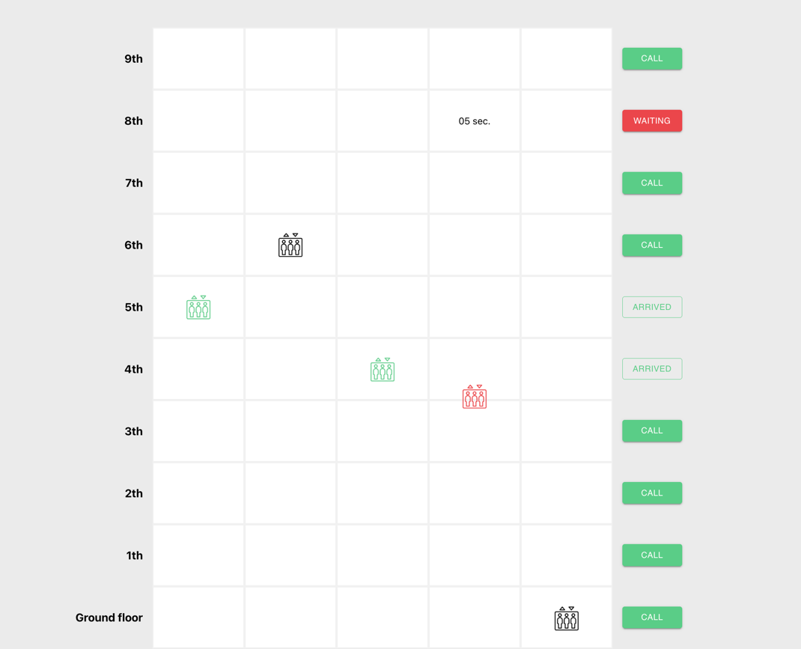

# Elevator Simulator

Welcome to the Elevator Simulator, a web-based application that simulates the behavior of elevators
in a building. This project provides a visual representation of elevators moving between floors
based on user calls.

## Installation

To run the client application locally, follow these steps:

1. Install dependencies:
   ```shell
    npm install

## Usage

Usage

1. Start the application
   ```shell
      npm start

2. Open your browser and visit http://localhost:3000 to use the elevator simulator.

## Main Page

### Configuration

The main page (Main) is the entry point of the application.
Adjust the number of elevators and floors by entering values in the input fields before starting the
simulation.

### Changing Elevator Speed

To change the speed of the elevator, modify the transitionDuration constant in the src/Constants.ts
file. This constant represents the duration of elevator transitions in milliseconds.

## Elevator Page

On the Elevator Page, you can interact with the elevators by calling them to specific floors and
observe their movements.

### Calling Elevators

Use the elevator buttons to call an elevator to a particular floor. Once called, the elevators will
respond to the call and move towards the designated floor.

### Observing Movement

As the elevators respond to calls, you can visually track their movement on the screen. The
elevators will change states (Available, Occupied, Arrived) based on their actions.

### Arrival Time Countdown

Upon calling an elevator, you will see a countdown timer displaying the estimated time for the
elevator to arrive at the designated floor. This countdown is visible on the floor where the
elevator is heading.

### Additional Information

- **Floor Display:** The floors are displayed on the left side of the page, allowing you to identify
  the current floor of each elevator.

- **Elevator States:**
    - **Available:** Elevator is available for new calls.
    - **Occupied:** Elevator is in transit to a called floor.
    - **Arrived:** Elevator has reached the called floor.

- **Button States:**

- **Available:** The button is in the available state, indicating that an elevator can be called to
  this floor.
- **Waiting:** The button is in the waiting state, indicating that the elevator is on its way to the
  called floor.
- **Arrived:** The button is in the arrived state, indicating that the elevator has reached the
  called floor.

### Technologies Used

- React: JavaScript library for building user interfaces.
- React Spring: Animation library for React applications.
- Material-UI: React components for faster and easier web development.


